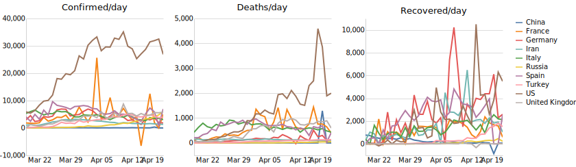
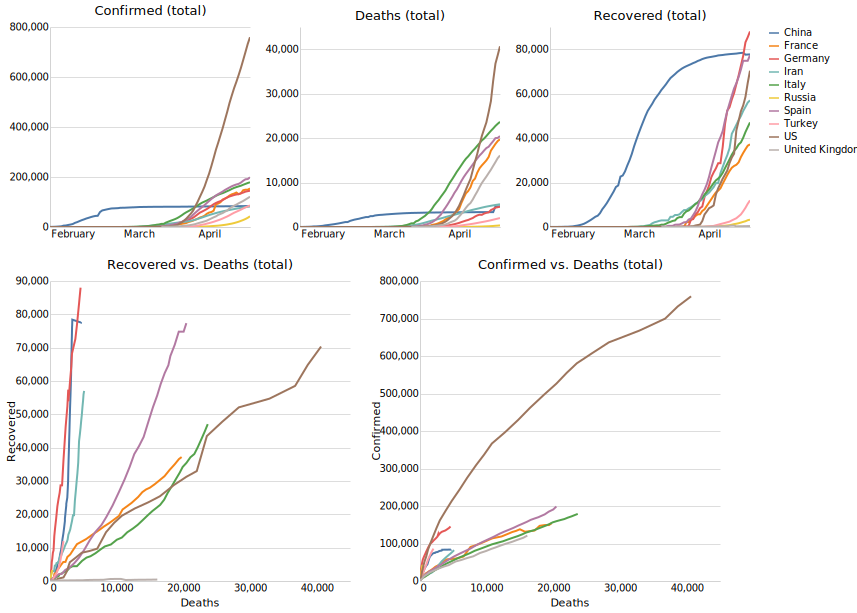
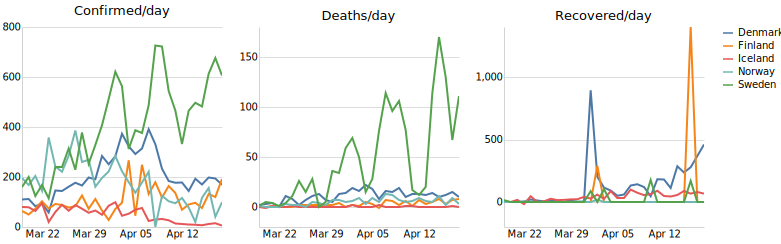
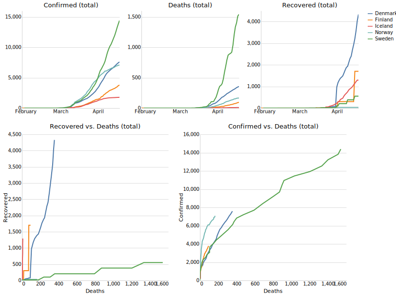
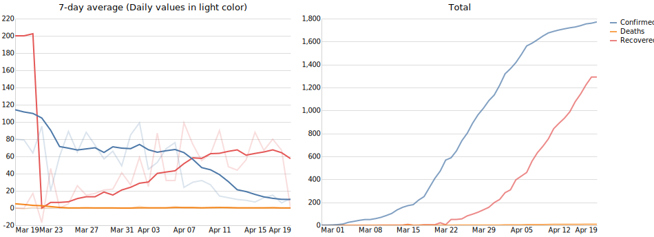
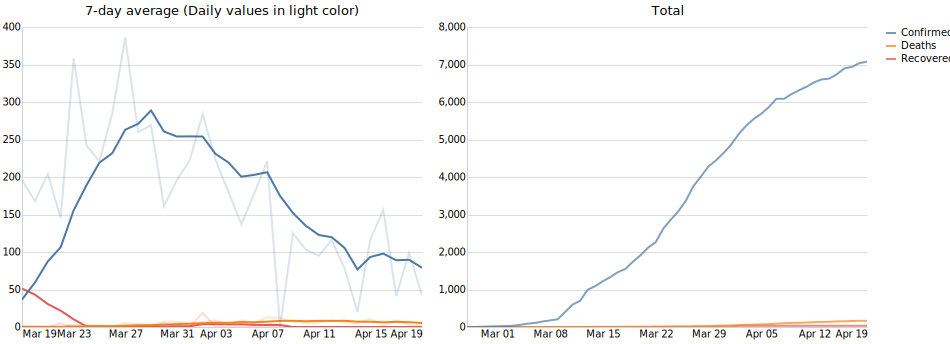

# COVID-19
Data analysis and visualizations related to the COVID-19 pandemic.
Data from [John Hopkins CSSE](https://github.com/CSSEGISandData/COVID-19.git) and data preprocessing by [Pascal Getreuer](https://getreuer.info/).

Data visualizations by [Alex Olwal](http://www.olwal.com/).

## Interactive graphs: 
[Comparing countries + Plotting curves for specific country](https://olwal.github.io/)

## The 10 countries with largest number of confirmed cases

## Denmark / Finland / Iceland / Norway / Sweden

### Denmark

### Finland

### Iceland

### Norway

### Sweden

