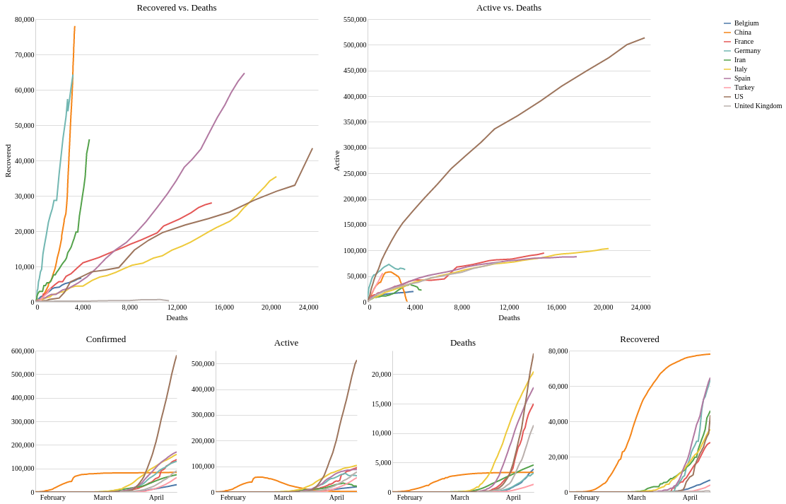
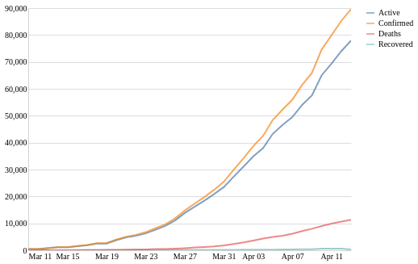

# COVID-19
Data analysis and visualizations related to the COVID-19 pandemic.
Data from [John Hopkins CSSE](https://github.com/CSSEGISandData/COVID-19.git) and data preprocessing by [Pascal Getreuer](https://getreuer.info/).

Data visualizations by [Alex Olwal](http://www.olwal.com/).

Interactive graphs: 
- [Comparing countries + Plotting curves for specific country](https://olwal.github.io/plots.htm)

Plots from 2020 04 13:

