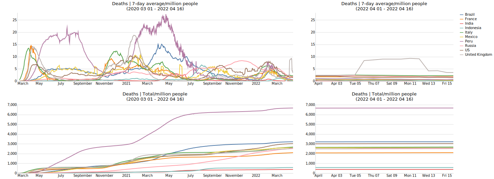
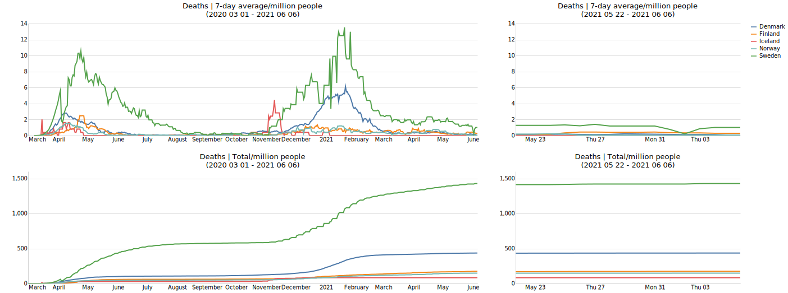

# COVID-19
Data analysis and visualizations related to the COVID-19 pandemic.

Uses data from [Data Packaged Core Datasets](https://github.com/datasets/) which maintains a [population dataset](https://github.com/datasets/population) and a [COVID-19 dataset](https://github.com/datasets/covid-19), which is a cleaned and normalized version of the data from [John Hopkins CSSE](https://github.com/CSSEGISandData/COVID-19.git).

These plots compare reported COVID-19 fatalities. Other plots over reported cases and recoveries are also available in this repository. 

## Interactive graphs: 
[Comparing countries + Plotting curves for specific country](https://olwal.github.io/)

## The 10 countries with largest number of confirmed cases

## Denmark / Finland / Iceland / Norway / Sweden

